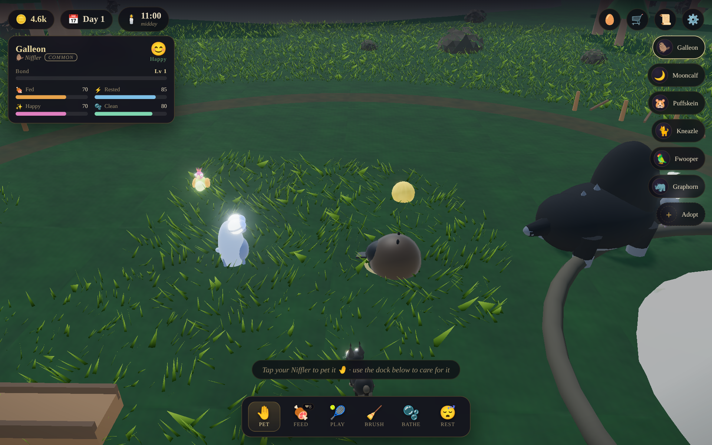

# 🐾 Hogwarts Beasts — Vivarium Keeper

A polished, browser-based **magical-creature care game** set on the grounds of Hogwarts.
Rescue magical beasts, raise them in a living vivarium beneath the castle, and care for
them — feed, groom, bathe, play, and bond — as a day/night cycle and the seasons turn
around you. Inspired by the beasts of *Hogwarts Legacy* and *Fantastic Beasts*.

> The whole game is rendered in real-time WebGL (three.js). Every creature, the castle,
> the grass, the water, the particle effects **and the sound** are generated
> procedurally — there is not a single image, model or audio file to download.



---

## ▶️ Play it

The game is a set of static files using ES modules, so it must be served over HTTP
(opening `index.html` from `file://` will not load the modules):

```bash
# from the project root
python3 -m http.server 8000
#   → open http://localhost:8000/index.html
```

…or any static server (`npx serve`, `vercel`, GitHub Pages, etc.). three.js is vendored
locally under `vendor/`, so **no internet connection is required** to play.

A desktop browser with WebGL2 is recommended; it is fully touch-enabled for mobile too.

---

## 🎮 How to play

- **Tap a beast** to select it; tap your active beast again to **pet** it.
- Use the **care dock** at the bottom: Pet · Feed · Play · Brush · Bathe · Rest.
- Each beast has four needs that drift down over time — **Fed, Rested, Happy, Clean**.
  Keep them up and your beast’s **mood** soars (and it pays you in Galleons).
- Feed a beast its **favourite food** for the biggest burst of joy and bond.
- **Bond** grows with every act of care; fill the bar to **level up**.
- 🪙 **Galleons** come from passive produce (collect it when a beast is content),
  daily **quests**, and **milestones**.
- Spend Galleons in **Eeylops & Co.** (food, toys, potions, habitat decor) and the
  **Sanctuary** (rescue new beasts).
- Place **decor** to calm the habitat and slow how fast needs drain.
- Scrub the **time of day**, change **weather** and **season** in Settings.

Your vivarium **saves automatically** to the browser. Come back later and your beasts
will have missed you.

---

## ✨ Deep systems

- **Genetics & growth** — every beast carries genes (colour, size, **personality**,
  rare **✨ Shiny**, coat pattern). They grow through life-stages — **Baby → Juvenile
  → Adult → Elder** — visibly getting bigger as you raise them.
- **Breeding** — pair two grown, happy beasts in the **Breeding Bower**, win their
  **Romance Dance** mini-game, and they lay an **egg** that incubates and hatches a
  new individual. Offspring inherit a fresh roll of both parents' genes with
  dominant/recessive rules and a mutation chance (shinies, colour morphs, hybrids).
- **Materials & the Workbench** — well-cared beasts yield magical **materials**
  (Niffler Trinkets, Unicorn Hair, Graphorn Dust…) when you collect, groom or bathe.
  Craft them into **Gourmet Treats**, **Growth Pellets**, a **Shiny Lure**, habitat
  charms and crystals.
- **Bestiary / Compendium** — a collection log of every species you've discovered,
  with lore, diet, the material it yields and your completion percentage.
- **Habitat Builder** — Room-of-Requirement style: pick decor and **tap to place,
  rotate and remove** it around the grounds. Decor calms beasts and slows need drift.
- **Broom flight** 🧹 — mount a broom and **soar over the grounds and the castle**
  with a chase camera (drag to steer, W/S to climb and dive).
- **Mini-games** — the **Romance Dance** (rhythm) gates breeding bonuses, and
  **Feeding Frenzy** (catch falling treats) boosts mood and earns Galleons.

The rendering is a stylized-PBR pipeline: fresnel **rim-lit** creatures, a cinematic
**colour-grade** (lift/contrast/split-tone/vignette/film-grain), bloom and SMAA.

---

## 🦄 The beasts

| Beast | Rarity | Loves | Note |
|-------|--------|-------|------|
| **Niffler** | Common | Galleons & gems | Hoards shiny things; digs for treasure |
| **Puffskein** | Common | Anything sweet | A purring ball of fluff with a darting tongue |
| **Jobberknoll** | Uncommon | Berries & bugs | A silent, speckled blue songbird |
| **Kneazle** | Uncommon | Fresh fish | A clever, spotted cat-beast; judges character |
| **Mooncalf** | Uncommon | Moon-pellets | Shy by day, dances on its hind legs at night |
| **Fwooper** | Rare | Bright berries | Outrageous plumage; struts and fans its tail |
| **Diricawl** | Rare | Fruit & greens | The magical dodo — vanishes and reappears |
| **Thestral** | Rare | Raw meat | A gentle, skeletal winged horse of the night |
| **Hippogriff** | Epic | Fresh fish | Proud eagle-horse — bow before you approach |
| **Graphorn** | Epic | Meat | A huge, horned, fiercely loyal mountain beast |
| **Unicorn foal** | Legendary | Sweet greens & honey | Radiant and pure; trusts only the gentle |

---

## 🏗️ Architecture

Plain ES modules, no build step. ~30 small files:

```
index.html                 entry point + import map (three is vendored)
src/
  main.js                  bootstrap, the Game facade, camera rig, input, loop
  core/
    util.js                math, seeded RNG, easing, procedural textures, DOM helpers
    renderer.js            WebGL renderer + post-processing + quality presets
    world.js               the vivarium: terrain, grass, water, castle, day/night,
                           weather, seasons, and the particle systems
    audio.js               procedural WebAudio ambience + SFX (no audio files)
  creatures/
    base.js                the Creature class — shared rig, AI, needs, animation
    index.js               species registry
    niffler.js … unicorn.js   one self-contained model per beast (procedural geometry)
  game/
    state.js               save game (localStorage), currency, inventory, beasts
    needs.js               need-drift model + mood
    actions.js             feed / pet / groom / wash / play / rest / collect
    items-data.js          food, treats, tools, toys, decor
    quests.js              daily tasks + lifetime milestones
    director.js            ties save-state to live creatures; clock; passive income
  ui/
    index.js               UI controller + modal scaffold
    hud.js                 top bar, beast card, care dock, food tray, roster
    shop.js / quests.js / settings.js / onboarding.js / toast.js
  styles/game.css          the candlelit-gold Hogwarts theme
vendor/three/              three.js r160 + the addons used (vendored from npm)
```

Adding a new beast is a single file in `src/creatures/` plus one line in
`creatures/index.js` — every system (AI, care, shop, quests, UI) picks it up
automatically from its `meta`.

---

## 🧪 Development

```bash
npm install            # only needed for the headless smoke test (playwright-core)
node tests/smoke.mjs   # loads the game in headless Chromium and checks for errors
node tests/visual.mjs  # captures composed screenshots (hero / menagerie / night / …)
```

The game itself needs no dependencies or build.

---

*Portkey Games / Wizarding World are trademarks of Warner Bros. This is a
non-commercial fan project built for fun and learning.*
